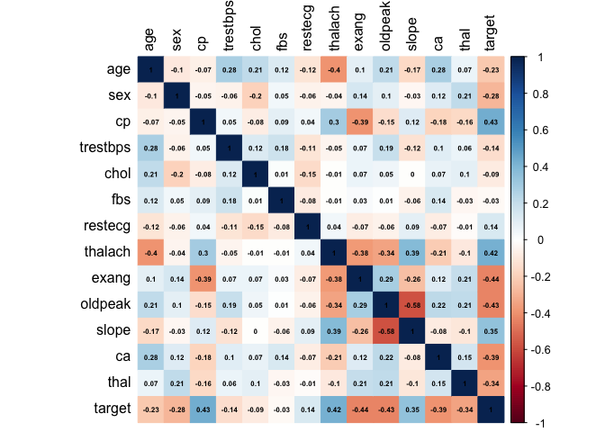
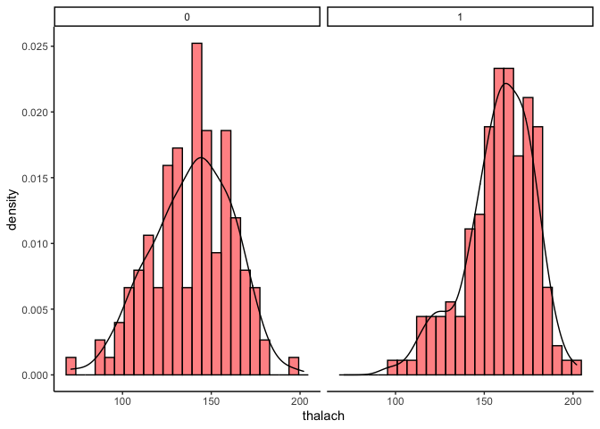
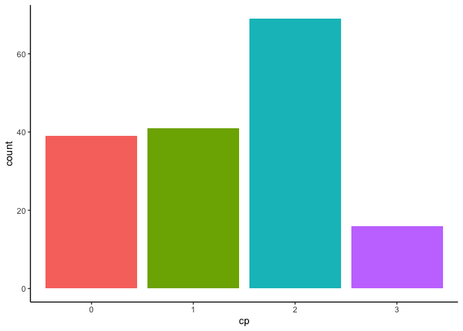
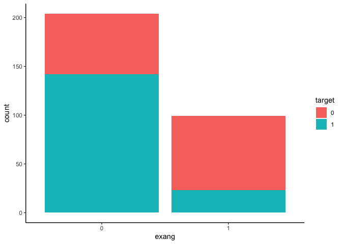
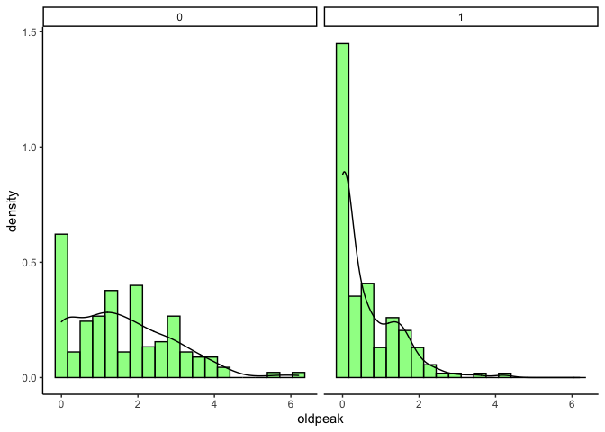
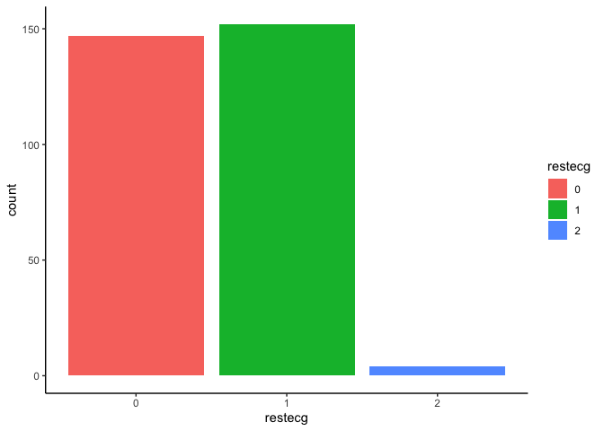
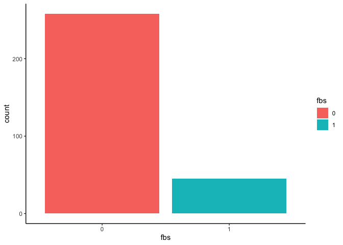
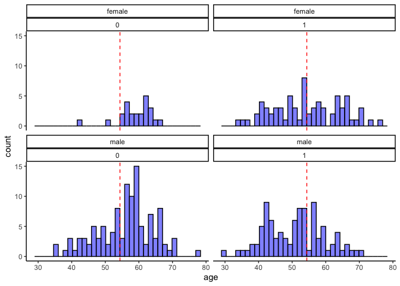
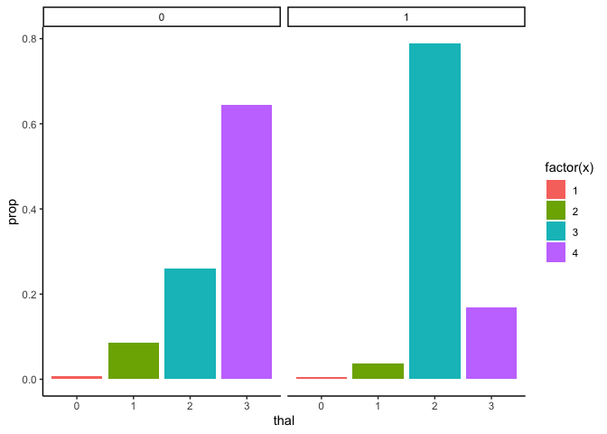
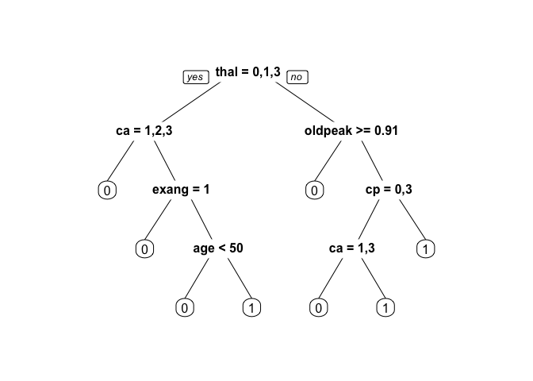

Heart disease classification
================
Irene N. Chang
12/24/2020

## Data description:

  - age : age in years
  - sex = (1 = male; 0 = female)
  - cp= chest pain type
  - trestbps= resting blood pressure (in mm Hg on admission to the
    hospital)
  - chol = serum cholestoral in mg/dl
  - fbs = ( fasting blood sugar \> 120 mg/dl) (1 = true; 0 = false)
  - restecg = resting electrocardiographic results
  - thalach = maximum heart rate achieved
  - exang = exercise induced angina (1 = yes; 0 = no)
  - oldpeak = ST depression induced by exercise relative to rest
  - slope = the slope of the peak exercise ST segment
  - ca = number of major vessels (0-3) colored by flourosopy
  - thal3 = normal; 6 = fixed defect; 7 = reversable defect
  - target = 1 or 0

Load the libraries needed

``` r
packages <- c("tidyverse", "ggplot2","gridExtra")
sapply(packages, require, character.only=T)
```

    ## Loading required package: tidyverse

    ## ── Attaching packages ───────── tidyverse 1.3.0 ──

    ## ✔ ggplot2 3.3.0     ✔ purrr   0.3.3
    ## ✔ tibble  2.1.3     ✔ dplyr   0.8.4
    ## ✔ tidyr   1.0.0     ✔ stringr 1.4.0
    ## ✔ readr   1.3.1     ✔ forcats 0.4.0

    ## ── Conflicts ──────────── tidyverse_conflicts() ──
    ## ✖ dplyr::filter() masks stats::filter()
    ## ✖ dplyr::lag()    masks stats::lag()

    ## Loading required package: gridExtra

    ## 
    ## Attaching package: 'gridExtra'

    ## The following object is masked from 'package:dplyr':
    ## 
    ##     combine

    ## tidyverse   ggplot2 gridExtra 
    ##      TRUE      TRUE      TRUE

``` r
data = read.csv("Heart Disease Dataset.csv")
head(data)
```

    ##   age sex cp trestbps chol fbs restecg thalach exang oldpeak slope ca thal
    ## 1  63   1  3      145  233   1       0     150     0     2.3     0  0    1
    ## 2  37   1  2      130  250   0       1     187     0     3.5     0  0    2
    ## 3  41   0  1      130  204   0       0     172     0     1.4     2  0    2
    ## 4  56   1  1      120  236   0       1     178     0     0.8     2  0    2
    ## 5  57   0  0      120  354   0       1     163     1     0.6     2  0    2
    ## 6  57   1  0      140  192   0       1     148     0     0.4     1  0    1
    ##   target
    ## 1      1
    ## 2      1
    ## 3      1
    ## 4      1
    ## 5      1
    ## 6      1

``` r
data$target <- as.factor(data$target)
ggplot(data, aes(target, fill=target)) + geom_bar() + theme_classic() + theme(legend.position = "none")
```

<!-- -->

The target is relatively balanced. We explore the data more

``` r
str(data)
```

    ## 'data.frame':    303 obs. of  14 variables:
    ##  $ age     : int  63 37 41 56 57 57 56 44 52 57 ...
    ##  $ sex     : int  1 1 0 1 0 1 0 1 1 1 ...
    ##  $ cp      : int  3 2 1 1 0 0 1 1 2 2 ...
    ##  $ trestbps: int  145 130 130 120 120 140 140 120 172 150 ...
    ##  $ chol    : int  233 250 204 236 354 192 294 263 199 168 ...
    ##  $ fbs     : int  1 0 0 0 0 0 0 0 1 0 ...
    ##  $ restecg : int  0 1 0 1 1 1 0 1 1 1 ...
    ##  $ thalach : int  150 187 172 178 163 148 153 173 162 174 ...
    ##  $ exang   : int  0 0 0 0 1 0 0 0 0 0 ...
    ##  $ oldpeak : num  2.3 3.5 1.4 0.8 0.6 0.4 1.3 0 0.5 1.6 ...
    ##  $ slope   : int  0 0 2 2 2 1 1 2 2 2 ...
    ##  $ ca      : int  0 0 0 0 0 0 0 0 0 0 ...
    ##  $ thal    : int  1 2 2 2 2 1 2 3 3 2 ...
    ##  $ target  : Factor w/ 2 levels "0","1": 2 2 2 2 2 2 2 2 2 2 ...

``` r
summary(data)
```

    ##       age             sex               cp           trestbps    
    ##  Min.   :29.00   Min.   :0.0000   Min.   :0.000   Min.   : 94.0  
    ##  1st Qu.:47.50   1st Qu.:0.0000   1st Qu.:0.000   1st Qu.:120.0  
    ##  Median :55.00   Median :1.0000   Median :1.000   Median :130.0  
    ##  Mean   :54.37   Mean   :0.6832   Mean   :0.967   Mean   :131.6  
    ##  3rd Qu.:61.00   3rd Qu.:1.0000   3rd Qu.:2.000   3rd Qu.:140.0  
    ##  Max.   :77.00   Max.   :1.0000   Max.   :3.000   Max.   :200.0  
    ##       chol            fbs            restecg          thalach     
    ##  Min.   :126.0   Min.   :0.0000   Min.   :0.0000   Min.   : 71.0  
    ##  1st Qu.:211.0   1st Qu.:0.0000   1st Qu.:0.0000   1st Qu.:133.5  
    ##  Median :240.0   Median :0.0000   Median :1.0000   Median :153.0  
    ##  Mean   :246.3   Mean   :0.1485   Mean   :0.5281   Mean   :149.6  
    ##  3rd Qu.:274.5   3rd Qu.:0.0000   3rd Qu.:1.0000   3rd Qu.:166.0  
    ##  Max.   :564.0   Max.   :1.0000   Max.   :2.0000   Max.   :202.0  
    ##      exang           oldpeak         slope             ca        
    ##  Min.   :0.0000   Min.   :0.00   Min.   :0.000   Min.   :0.0000  
    ##  1st Qu.:0.0000   1st Qu.:0.00   1st Qu.:1.000   1st Qu.:0.0000  
    ##  Median :0.0000   Median :0.80   Median :1.000   Median :0.0000  
    ##  Mean   :0.3267   Mean   :1.04   Mean   :1.399   Mean   :0.7294  
    ##  3rd Qu.:1.0000   3rd Qu.:1.60   3rd Qu.:2.000   3rd Qu.:1.0000  
    ##  Max.   :1.0000   Max.   :6.20   Max.   :2.000   Max.   :4.0000  
    ##       thal       target 
    ##  Min.   :0.000   0:138  
    ##  1st Qu.:2.000   1:165  
    ##  Median :2.000          
    ##  Mean   :2.314          
    ##  3rd Qu.:3.000          
    ##  Max.   :3.000

``` r
any(is.na(data))
```

    ## [1] FALSE

There is no missing value in our dataset.

``` r
cor_data <- data
cor_data$target <- as.numeric(cor_data$target)
cor_matrix <- cor(cor_data)

library(corrplot)
```

    ## corrplot 0.84 loaded

``` r
corrplot(cor_matrix, method = "color", addCoef.col = "black", number.cex = 0.5, tl.col="black")
```

<!-- -->

We now take a closer look at the variables that seem to correlate fairly
strongly with our target variable: thalach, cp, exang, oldpeak.

``` r
ggplot(data, aes(thalach))+
    geom_histogram(aes(y = ..density..),bins=25, fill="red", alpha = 0.5, color = "black")+
    geom_density()+
    theme_classic()+
    facet_wrap(~target)
```

<!-- -->

``` r
data$cp <- as.factor(data$cp)
data %>% group_by(cp) %>%
    subset(target == 1) %>%
    ggplot(aes(cp)) + geom_bar(aes(fill = cp)) + theme_classic() + theme(legend.position = "none")
```

<!-- -->

``` r
data$exang <- factor(data$exang)
ggplot(data, aes(exang, fill=target))+geom_bar() + theme_classic()
```

<!-- -->

``` r
ggplot(data, aes(oldpeak))+
    geom_histogram(aes(y = ..density..),bins=20, fill="green", alpha = 0.5, color = "black")+
    geom_density()+
    theme_classic()+
    facet_wrap(~target)
```

<!-- -->

``` r
data$restecg <- factor(data$restecg)
ggplot(data, aes(restecg, fill=restecg)) + geom_bar() + theme_classic()
```

<!-- -->

``` r
data$fbs <-factor(data$fbs)
ggplot(data, aes(fbs, fill=fbs)) + geom_bar() + theme_classic()
```

<!-- -->

Not many people died from complications of high suger level.

The age distribution of the observations

``` r
data$sex <- factor(data$sex)
sex.labs <- c("male", "female")
names(sex.labs) <- c("1", "0")
ggplot(data, aes(age))+
    geom_histogram(bins = 35, fill="blue", alpha = 0.5, color = "black")+
    theme_classic()+
    facet_wrap(sex~target, labeller=labeller(sex=sex.labs))+
    geom_vline(xintercept = mean(data$age), color = "red", linetype = "dashed")
```

<!-- -->

``` r
data$slope <- factor(data$slope)
data$ca <- factor(data$ca)
data$thal <- factor(data$thal)
ggplot(data, aes(thal, group = target))+
    geom_bar(aes(y = ..prop.., fill = factor(..x..)), stat="count") +
    # prop is geom_bar features, not in geom_col
    facet_wrap(~target)+
    theme_classic()
```

<!-- -->

Normalize the numeric data

``` r
data$trestbps <- scale(data$trestbps)
data$chol <- scale(data$chol)
data$thalach <- scale(data$thalach)
data$oldpeak <- scale(data$oldpeak)
summary(data)
```

    ##       age        sex     cp          trestbps.V1           chol.V1      
    ##  Min.   :29.00   0: 96   0:143   Min.   :-2.145254   Min.   :-2.320322  
    ##  1st Qu.:47.50   1:207   1: 50   1st Qu.:-0.662770   1st Qu.:-0.680369  
    ##  Median :55.00           2: 87   Median :-0.092585   Median :-0.120855  
    ##  Mean   :54.37           3: 23   Mean   : 0.000000   Mean   : 0.000000  
    ##  3rd Qu.:61.00                   3rd Qu.: 0.477601   3rd Qu.: 0.544773  
    ##  Max.   :77.00                   Max.   : 3.898716   Max.   : 6.130260  
    ##  fbs     restecg     thalach.V1      exang       oldpeak.V1      slope  
    ##  0:258   0:147   Min.   :-3.433587   0:204   Min.   :-0.895381   0: 21  
    ##  1: 45   1:152   1st Qu.:-0.704944   1: 99   1st Qu.:-0.895381   1:140  
    ##          2:  4   Median : 0.146392           Median :-0.206364   2:142  
    ##                  Mean   : 0.000000           Mean   : 0.000000          
    ##                  3rd Qu.: 0.713950           3rd Qu.: 0.482653          
    ##                  Max.   : 2.285648           Max.   : 4.444498          
    ##  ca      thal    target 
    ##  0:175   0:  2   0:138  
    ##  1: 65   1: 18   1:165  
    ##  2: 38   2:166          
    ##  3: 20   3:117          
    ##  4:  5                  
    ## 

### Modeling

1/ GLM

``` r
library(caTools)
set.seed(4)
sample <- sample.split(data$target,SplitRatio = 0.7)
train <- subset(data, sample == T)
test <- subset(data, sample == F)
glm.fit <- glm(target~., data = train, family=binomial(logit))
#summary(glm.fit)
glm.pred <- predict(glm.fit, newdata=test, type="response")
glm.pred <- ifelse(glm.pred>0.5, 1, 0)
mean(glm.pred != test$target)
```

    ## [1] 0.1318681

2/ Random forest with k-fold cross validation

``` r
library(randomForest)
```

    ## randomForest 4.6-14

    ## Type rfNews() to see new features/changes/bug fixes.

    ## 
    ## Attaching package: 'randomForest'

    ## The following object is masked from 'package:gridExtra':
    ## 
    ##     combine

    ## The following object is masked from 'package:dplyr':
    ## 
    ##     combine

    ## The following object is masked from 'package:ggplot2':
    ## 
    ##     margin

``` r
library(boot)
set.seed(4)
k = 10
folds <-  sample(1:k, nrow(data), replace = T)
cv.errors <- rep(NA,k)
for(j in 1:k){
    rf.model <- randomForest(target~., data = data[folds!= k,])
    rf.pred <- predict(rf.model,data[folds==j,])
    cv.errors[j]= mean((data[folds==j,"target"]!=rf.pred))
}
mean(cv.errors)
```

    ## [1] 0.0137931

3/ SVM with k-fold cross validation

``` r
library(e1071)
set.seed(4)
k = 10
folds <-  sample(1:k, nrow(data), replace = T)
cv.errors <- rep(NA,k)
for(j in 1:k){
    svm.model <- svm(target~., data = data[folds!= k,])
    svm.pred <- predict(svm.model,data[folds==j,])
    cv.errors[j]= mean((data[folds==j,"target"]!=svm.pred))
}
mean(cv.errors)
```

    ## [1] 0.1399178

4/ Tree methods

``` r
library(rpart)
library(rpart.plot)
library(caTools)
set.seed(150)
sample <- sample.split(data$target,SplitRatio = 0.7)
train <- subset(data, sample == T)
test <- subset(data, sample == F)
tree.md <- rpart(target~., method = "class", data = train)
tree.pred <- predict(tree.md, test)
tree.pred <- ifelse(glm.pred>0.5, 1, 0)
mean(tree.pred != test$target)
```

    ## [1] 0.1318681

``` r
prp(tree.md)
```

<!-- -->

Overall, Random Forest model performs the best.
